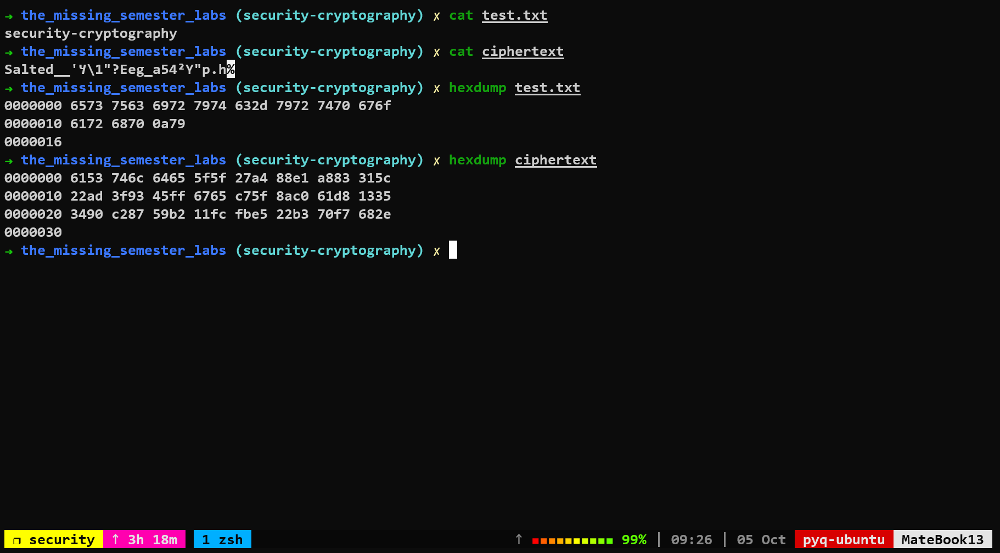

# Lab Ⅷ. Security and Cryptography Labs

[对数计算网站](https://www.23bei.com/tool/42.html)
1. 假设一个密码是由四个小写的单词拼接组成，每个单词都是从一个含有10万单词的字典中随机选择，且每个单词选中的概率相同。 一个符合这样构造的例子是correcthorsebatterystaple。这个密码有多少比特的熵？
    $log_2^{100000^4} = 66.43856$
2. 假设另一个密码是用八个随机的大小写字母或数字组成。一个符合这样构造的例子是rg8Ql34g。这个密码又有多少比特的熵？
    $log_2^{62^8} = 47.63357$
3. 哪一个密码更强？
    > 密码1更强，因为其熵更大
4. 假设一个攻击者每秒可以尝试1万个密码，这个攻击者需要多久可以分别破解上述两个密码？
    $密码1：100000^4 / 10000 = 10^{20}$
    $密码2：62^8 / 10000 = 21,834,010,558$
5. [从Debian镜像站](https://www.debian.org/CD/http-ftp/)下载一个光盘映像（比如这个来自[阿根廷镜像站的镜像](https://cdimage.debian.org/debian-cd/current/amd64/iso-cd/debian-11.5.0-amd64-netinst.iso)。使用sha256sum命令对比下载映像的哈希值和官方Debian站公布的哈希值。如果你下载了上面的映像，官方公布的哈希值可以参考[这个文件](https://cdimage.debian.org/debian-cd/current/amd64/iso-cd/SHA256SUMS)。
    ```shell
     curl -O https://cdimage.debian.org/debian-cd/current/amd64/iso-cd/debian-11.5.0-amd64-netinst.iso
     curl -O https://cdimage.debian.org/debian-cd/current/amd64/iso-cd/SHA256SUMS
     sha256sum debian-11.5.0-amd64-netinst.iso
    ```
    > PS：发现计算出来和sha256值和给出的不一致.........不知道是我步骤的问题还是文件的问题
6. 使用[OpenSSL](https://www.openssl.org/)的AES模式加密一个文件: `openssl aes-256-cbc -salt -in {源文件名} -out {加密文件名}`。 使用cat或者hexdump对比源文件和加密的文件，再用 `openssl aes-256-cbc -d -in {加密文件名} -out {解密文件名}` 命令解密刚刚加密的文件。最后使用cmp命令确认源文件和解密后的文件内容相同。
    ```shell
    # 加密
    echo 'security-cryptography' > test.txt
    openssl aes-256-cbc -salt -in test.txt -out ciphertext
    cat test.txt
    cat ciphertext
    hexdump test.txt
    hexdump ciphertext
    ```
    
    
    ```shell
    #解密
    openssl aes-256-cbc -d -in ciphertext -out plaintext
    cmp plaintext test.txt
    ```
7. 在你自己的电脑上使用更安全的[ED25519算法](https://wiki.archlinux.org/index.php/SSH_keys#Ed25519)生成一组[SSH密钥对](https://www.digitalocean.com/community/tutorials/how-to-set-up-ssh-keys--2)。为了确保私钥不使用时的安全，一定使用密码加密你的私钥。
    ```shell
    ssh-keygen -t ed25519
    ```
8. [配置GPG](https://www.digitalocean.com/community/tutorials/how-to-use-gpg-to-encrypt-and-sign-messages)。
    ```shell
    sudo apt-get update
    sudo apt-get install gnupg
    gpg --gen-key
    ```
9. 给Anish发送一封加密的电子邮件（[Anish的公钥](https://keybase.io/anish)）。
10. 使用`git commit -S`命令签名一个Git提交，并使用`git show --show-signature`命令验证这个提交的签名。或者，使用`git tag -s`命令签名一个Git标签，并使用`git tag -v`命令验证标签的签名。